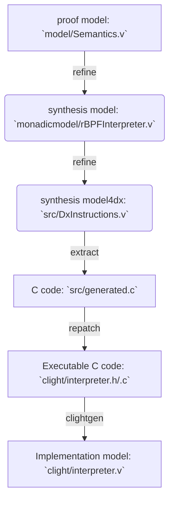

# CertrBPF

`CertrBPF` is a formally verified rBPF verifier + interpreter + JIT (ongoing) in Coq. ([rBPF](https://github.com/future-proof-iot/Femto-Container) is a register-based virtual machine of eBPF)

## Overview

Currently, `CertrBPF` includes a verified verifier and an interpreter (**done**), it will support a JIT compiler later (**ongoing**): The very simple but safe verifier statically checks the input rBPF instructions in order to reject any invalid rBPF programs. If an rBPF program is valid, the interpreter next is to execute it. The interpreter is fault-isolating: it is never crashed (precisely, no unexpected behaviors) because the static checking (verifier) and the dynamic checking (interpreter itself) are designed to avoid those cases.

The development of `CertrBPF` follows the three-level models:
- The proof model: formalize the target software
- The synthesis model: refine/optimize the proof model and make it as close as possible to the target code style. We have an additional model to refine the synthesis model (named dx model), it adds some dx configuration and it is totally equivalent to the synthesis model. For simplicity, we consider the dx model is a part of the synthesis model
- The implementation model: formalize the extracted C impelemtnation in CompCert Clight AST (i.e. coq code)

The dx tool is used to automatically translate the dx model into C code. To make the extracted C code executable, a repatching process (`repatch` and `verifier/repatch`) is necessary currently. The Clight AST is automatically generated by [VST-clight](https://github.com/PrincetonUniversity/VST).

The end-to-end mechanised proof is in Coq:
- prove the proof model satisfies expected properties
- prove the refinement/equivalence among the proof model, the synthesis model, and the dx model
- prove the simulation (i.e. refinement) between the synthesis model and the implementation model.

To help the last step, we design a minimal logic for Clight (`clightlogic`).


`CertrBPF-verifier` consists of:
- The proof model & synthesis model (`verifier/comm, dxmodel, synthesismodel`): formalization of [the rBPF verifier](https://github.com/future-proof-iot/Femto-Container/blob/main/src/verify.c) and related dx configuration.
- The clight model (`verifier/clightmodel`)
- The property (`verifier/property/invariant.v`): `CertrBPF-verifier` implies a `verifier_invariant` used by the following `CertrBPF-interpreter`
- The property (`verifier/property/equivalence.v`): equivalence between the synthesis model and the dx model
- The simulaton (`verifier/simulation`): the clight model refines the synthesis model

`CertrBPF-interpreter` consists of:

- The proof model (`comm`+`model`): formal syntax and semantics of rBPF ISA

- The synthesis model (`monadicmodel`+`dxcomm`+`dxmodel`): an optimizated & formal rBPF interpreter model whose *code-style* is very close to the original rBPF C implementaion.

- The clight model (`clight`): re-extracted C to a CompCert Clight model by [VST-clight](https://github.com/PrincetonUniversity/VST)

- The isolation property (`isolation`): the invariants and the expected isolation property proof.

- The equivalence proof (`equivalence`): the proof model = the synthesis model = the dx model.

- The simulation proof (`simulation`): the clight model refines the synthesis model.

There are also some folders:
2. `repatch`: repatching the dx-extracted C implementation in order to make it executable.
3. `benchmark data`: all experiment data from our benchmarks.

## Installation

### Dependencies

To install CertrBPF (and dx), you will require:
-   Linux (e.g. Ubuntu)
-   `make` (and standard tools: `sed`, `awk`, `cat`)
-   Coq
-   coq-elpi
-   CompCert32 (version 3.9)
-   VST32 (version 2.8)
-   OCaml compiler

CertrBPF is currently developed with the following versions of these
dependencies:

```shell
opam list ocaml coq coq-elpi coq-compcert-32 coq-vst-32
# Name          # Installed # Synopsis
coq             8.13.2      Formal proof management system
coq-compcert-32 3.9         The CompCert C compiler (32 bit)
coq-elpi        1.11.0      Elpi extension language for Coq
coq-vst-32      2.8         Verified Software Toolchain
ocaml           4.11.1      The OCaml compiler (virtual package)

```
### Building CertrBPF

_NB: you need to modify the makefile of the source project_, to run this repo:
1. install `dx`
```shell
$ git clone https://gitlab.univ-lille.fr/samuel.hym/dx
$ cd dx
$ ./configure ...
$ ./configure --install-compcert-printer --cprinterdir=/home/YOUR-NAME/.opam/YOUR-BPF-OPAM-SWITCH/lib/coq/user-contrib/dx/extr
$ make; make install
```
2. download this repo and config the Makefie.config:
```shell
$ git clone THIS-REPO
$ cd rbpf-dx
$ vim Makefile.config #`OPAMPREFIX := `/home/YOUR-NAME/.opam/YOUR-BPF-OPAM-SWITCH`
$ make all
```

*You also need to set path of Compcert32 in the environment.*

## Checking Coq code

`make all`
1. compiling the proof model, the synthesis model and the clight model;

2. extracting the verified C implementation; 

3. extracting Clight implemementation model;

4. checking the isolation proof of the proof model.

5. checking the equivalence relation (equality) among the proof model and two synthesis models.

6. checking the simulation relation proof (refinement) from Coq to Clight.


## Workflow: interpreter

- **compile**:


- **proof**:


## Benchmarks and Experiments

TBC...

