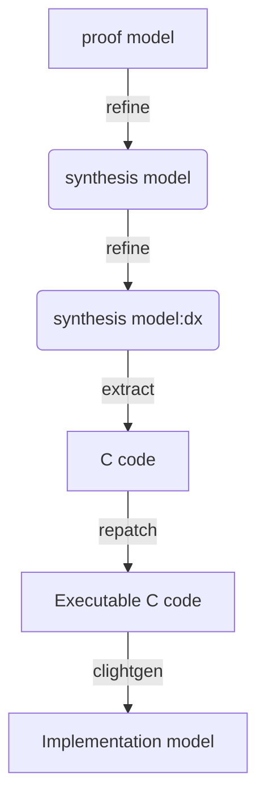
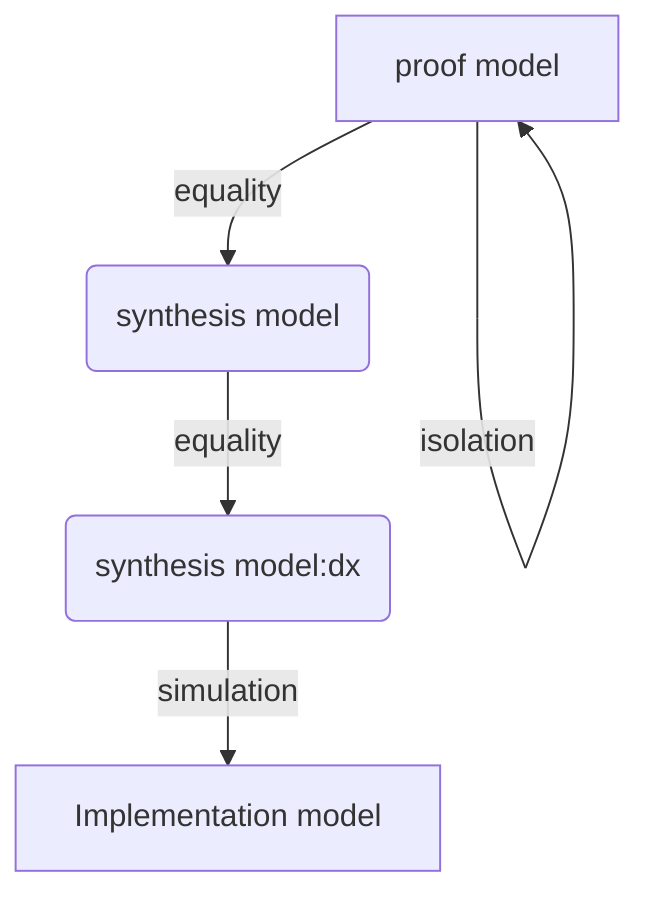

# rbpf-dx

A testing project for using dx to transform exam_rbpf in Coq to C

# rbpf-dx Overview

The toy project is to use [dx](https://gitlab.univ-lille.fr/samuel.hym/dx) to generate C code from our toy rBPF interpreter (in Coq).

The rBPF Coq interpreter consists of:
- codeTest: `proof part`.
- tests: `code generation part`
    - DxInstructions.v: the semantics of rBPF instruciton set.
    - DxMonad.v: our monad information
    - DxList64.v, Int16.v ... : some necessary libraries.
    - TestMain.v, ExtraMain.v, Tests.v: call dx to extract c code!

Before installing this repo, making sure that you have installed necessary libs of dx (see below: the description of dx)!!!

_NB: we modify the makefile of the source project_, to run this repo:
1. install `dx`
```shell
$ git clone https://gitlab.univ-lille.fr/samuel.hym/dx
$ cd dx
$ ./configure ...
$ ./configure --install-compcert-printer --cprinterdir=/home/YOUR-NAME/.opam/YOUR-BPF-OPAM-SWITCH/lib/coq/user-contrib/dx/extr
$ make; make install
```
2. download this repo and config  the Makefie.config:
```shell
$ git clone https://gitlab.inria.fr/syuan/rbpf-dx.git
$ cd rbpf-dx
$ vim Makefile.config #`OPAMPREFIX := /home/shyuan/.opam/4.11.1` -> `/home/YOUR-NAME/.opam/YOUR-BPF-OPAM-SWITCH`
$ make
```

Remember:
1. The default dx install folder we use is `/home/your-name/.opam/bpf`: making sure that you config the `--compcert-printer` and `--cprinterdir`.
2. be careful to use positive as variables' id, because dx/compcert also uses postive numbers to represent variables: there will be a conflict if your positive number is too small and it overlaps with existing variables.

Makefile command list:
`make all` = compile rbpf (`make compile`) + extract c code (`make extract`) + generate clight code (`make clight`) + prove Coq2C equivalence `make proof`.

## Workflow

- **compile**:


- **proof**:



