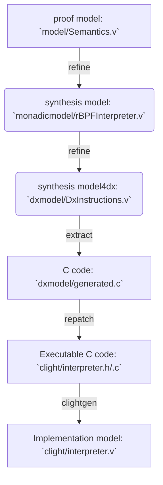
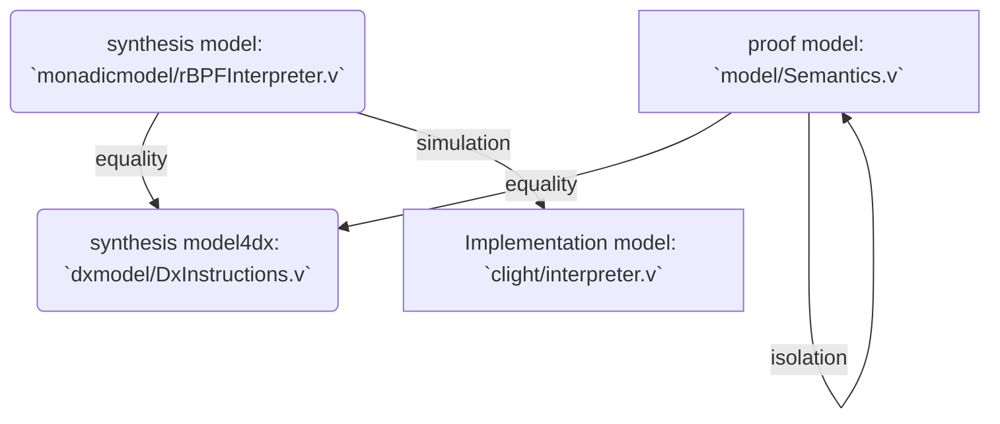

# Overview

_NB: The latest stable version is in the branch `CAV22-AE`_

`CertrBPF` is a formally verified rBPF verifier + interpreter obtained by refinement of a Coq specification. ([rBPF](https://github.com/future-proof-iot/Femto-Container) is a register-based virtual machine of eBPF)

`CertrBPF` includes a verified C verifier and interpreter. The
verifier performs static checks to verify that the rBPF instructions
are syntactically correct.  If the verification succeeds, the program is run by the interpreter.
The static verification and the dynamic checks ensure *software fault isolation* of the running rBPF propgram.
Namely, we have the guarantee that:
- The interpreter never crashes. More precisely, the proved C  program is free of undefined behaviours such as division by zero or invalid memory accesses.
- All the memory accesses are performed in designated memory regions which are an argument of the interpreter.


The development of `CertrBPF` follows a refinement methodology with three main layers:
- The proof model: an executable Coq specification of the rBPF virtual machine
- The synthesis model: a refined and optimised executable Coq program that is close in style to a C program. 
  Eventually, we have the synthesis model (named dx model) which is compliant with the dx C extraction tool.
- The implementation model: the extracted C implementation in the form of CompCert Clight AST.

The dx tool is used to automatically translate the dx model into C
code. To make the extracted C code executable, a repatching process
(`repatch` and `verifier/repatch`) is necessary. The Clight AST is
automatically generated by
[VST-clightgen](https://github.com/PrincetonUniversity/VST).

The end-to-end mechanised proof is done in Coq:
- prove the proof model satisfies expected properties
- prove the refinement/equivalence among the proof model, the synthesis model, and the dx model
- prove the simulation (i.e. refinement) between the synthesis model and the implementation model.

To help the last step, we design a minimal logic for Clight (`clightlogic`).


`CertrBPF-verifier` consists of:
- The proof model & synthesis model (`verifier/comm, dxmodel, synthesismodel`): formalization of [the rBPF verifier](https://github.com/future-proof-iot/Femto-Container/blob/main/src/verify.c) and related dx configuration.
- The clight model (`verifier/clightmodel`)
- The property (`verifier/property/invariant.v`): `CertrBPF-verifier` implies a `verifier_invariant` used by the following `CertrBPF-interpreter`
- The property (`verifier/property/equivalence.v`): equivalence between the synthesis model and the dx model
- The simulaton (`verifier/simulation`): the clight model refines the synthesis model

`CertrBPF-interpreter` consists of:

- The proof model (`comm`+`model`): formal syntax and semantics of rBPF ISA

- The synthesis model (`monadicmodel`+`dxcomm`+`dxmodel`): an optimizated & formal rBPF interpreter model whose *code-style* is very close to the original rBPF C implementaion.

- The clight model (`clight`): re-extracted C to a CompCert Clight model by [VST-clightgen](https://github.com/PrincetonUniversity/VST)

- The isolation property (`isolation`): the invariants and the expected isolation property proof.

- The equivalence proof (`equivalence`): the proof model = the synthesis model = the dx model.

- The simulation proof (`simulation`): the clight model refines the synthesis model.

There are also some folders:

1. `benchmark_data`: all experiment data from our benchmarks.
2. `doc`: CAV22 draft
3. `html`: the html files of the whole Coq development, it could be generated by `make all` or `make document`
4. `measure`: visualization of evaluation results
5. `repatch`: repatching the dx-extracted C implementation in order to make it executable.

# Authors
Authors information, please check [author](AUTHORS.md).

# Link to paper
The relation between our CAV22 paper and this coq development. See [linktopaper](LINKTOPAPER.md).

We also provide a makefile command to generate html files (see [html](html)) in order to help users to read the coq development without executing Coq code (it uses the [coq2html](https://github.com/xavierleroy/coq2html) tool)

```shell
# make sure you have installed `coq2html` and compiled the CertrBPF before (i.e. `make all`)
make document
```

## Code statistics

[CLOC](CLOC.md) shows the statistics on the complete specifications and proofs of CertrBPF.


# Installation

## VirtualMachine installation 
We provide a [Virtual Machine (.ova)](https://zenodo.org/record/6558015#.YnVZr9pByUk) that the development environment is available. Note that: **This VM doesn't support connecting any physical boards and we recommend readers use Ubuntu and follow the [RIOT documentation](benchmark_data/RIOT/doc/doxygen/src/getting-started.md) to build the RIOT-OS world and then reproduce the results of our paper.**

### Update VM
The VM may be out-of-date, to get the latest version of CertrBPF, please follow the instructions:
```shell
# current folder: /home/cav/CertrBPF/rbpf-dx
git fetch --all
git reset --hard origin/CAV22-AE

# then you could build CertrBPF by running `make all`
```

### VM resource requirements 
We tested this VM on the following environments:
- OS = Windows 10 famille (version: 19044.1706)
- RAM = 16G
- CPU = Intel(R) Core(TM) i7-10710U CPU @ 1.10GHz   1.61 GHz
- cores = 6
- logical processors = 12
- virtualbox = VirtualBox-6.1.34-150636-Win
- virtualbox VM setting:
  - memory size = 2048MB
  - processors' number = 6
  - DRAM = 16MB

### How long of running the scripts

We also measured the execution time of scripts `make all`
```shell
# current folder: /home/cav/CertrBPF/rbpf-dx 
$ time (make all)
real 9m49,045s
user 8m45,619s
sys  0m27,199s
```

## Manual Installation
see [install](INSTALL.md)

### Build of verified verifier and interpreter

```shell
cd /home/cav/CertrBPF/rbpf-dx
make all # you could always `make clean` firstly to get a clean environment
```

## Checking Coq code

`make all`
1. compiling the proof model, the synthesis model and the clight model;

2. extracting the verified C implementation; 

3. extracting Clight implemementation model;

4. checking the isolation proof of the proof model.

5. checking the equivalence relation (equality) among the proof model and two synthesis models.

6. checking the simulation relation proof (refinement) from Coq to Clight.

## Workflow: interpreter

- **compile**:


- **proof**:


# Benchmarks and Experiments


The benchmark applications are available in the `benchmark_data` directory. It
contains the main RIOT tree as used to produce the results and the two benchmark
applications.

The benchmark applications are automated. They will execute on the targeted
platform and output the benchmark results over the available serial console
after running the benchmark.

We provide two ways to do the experiments:
- **Building for the native port of RIOT**, the VirtualMachine only supports this one. Note that, this native-board experiment, as a sample, is only used to show how our benchmarks work if users don't have any physical boards. 
- **Building for the Nordic nRF52DK/Espressif WROOM-32/Sipeed Longan Nano GD32VF103CBT6**, the VirtualMachine doesn't support it (it is too difficult to connect RIOT-OS with a physical board on a Virtualbox VM), we recommend readers use Ubuntu and follow the [RIOT documentation](benchmark_data/RIOT/doc/doxygen/src/getting-started.md) to build the RIOT-OS world. This way could reproduct the evaluation results shown in our CAV paper.

## Details of benchmarks

We provide two benchmark applications:
- [bench_bpf_coq_incr](benchmark_data/bench_bpf_coq_incr): measuring the sliding window average (x-axis: Number of samples to average; y-axis: us per execution). 
- [bench_bpf_coq_unit](benchmark_data/bench_bpf_coq_unit): measuring execution per instrucitons (x-axis: Id of selected instructions; y-axis: us per instruction).

The second application tests the following eBPF/rBPF instructions:

0. ALU neg64
1. ALU Add
2. ALU Add imm
3. ALU mul imm
4. ALU rsh imm
5. ALU div imm
6. MEM ldxdw
7. MEM stdw
8. MEM stxdw
9. Branch always
10. Branch eq (jump)
11. Branch eq (cont)

When executing the benchmark applications, a CSV content is printed as output and slightly modified to make it easier for LaTeX.
- `bench_bpf_coq_incr` has the output format:

| test | duration | code | usperexec | kexecspersec |
| ---  | ---      | ---  | ---       |  ---         |
| x-axis|         |      | y-axis    |              |

- `bench_bpf_coq_unit` has the output format:

| duration | code | usperinst | instrpersec  |
| ---      | ---  | ---       |  ---         |
|          |      | y-axis    |              |


## Building for the native board (i.e. Ubuntu) of RIOT
```shell
# do the experiments on native board

# current folder: /home/cav/CertrBPF/rbpf-dx

# test bench_bpf_coq_incr
# 0. compile CertBPF
make -C benchmark_data/bench_bpf_coq_incr/bpf
make -C benchmark_data/bench_bpf_coq_incr

# 1. run on a native board, i.e. ubuntu, using CertBPF
# 2. save the output as `certrbpf_incr.csv`
make -C benchmark_data/bench_bpf_coq_incr term


# 3. complie original rBPF: Vanilla-rBPF
make -C benchmark_data/bench_bpf_coq_incr BPF_COQ=0 BPF_USE_JUMPTABLE=0

# 4. run this application
# 5. save the output as `rbpf_incr.csv`
make -C benchmark_data/bench_bpf_coq_incr BPF_COQ=0 BPF_USE_JUMPTABLE=0 term

# test bench_bpf_coq_unit
# 6. compile CertBPF
make -C benchmark_data/bench_bpf_coq_unit

# 7. execute this application
# 8. save the output as `certrbpf_unit.csv`
make -C benchmark_data/bench_bpf_coq_unit term


# 9. complie original rBPF: Vanilla-rBPF
make -C benchmark_data/bench_bpf_coq_unit BPF_COQ=0 BPF_USE_JUMPTABLE=0

# 10. execute this application
# 11. save the output as `rbpf_unit.csv`
make -C benchmark_data/bench_bpf_coq_unit BPF_COQ=0 BPF_USE_JUMPTABLE=0 term
```

We provide an [online latex template](https://www.overleaf.com/read/vsrfrxprzhyt) to show the visualization from the original data.

1. copy the template;

2. overwrite the [measurements](measure/measurements) folder with the four files.

3. use a latex compiler (offline or online e.g. overleaf) to get the visualization. The configuration of your latex compiler is:
- compiler: pdfLaTeX
- TeX Live version: 2021
- Main document: main.tex

## Building for the Nordic nRF52DK

_NB: Test the following instructions on your workspace e.g. Ubuntu instead of the provided Virtualbox VM_

To build the example applications, a toolchain is required. See the included
[RIOT documentation](benchmark_data/RIOT/doc/doxygen/src/getting-started.md) for
the exact tools required for each target platform.

e.g. 
```shell
sudo apt install git gcc-arm-none-eabi make gcc-multilib openocd gdb-multiarch doxygen wget unzip python3-serial

# you also need to download pip3, Twisted, JLink, etc
sudo apt install python3-pip
pip3 install Twisted
# following the web https://primalcortex.wordpress.com/tag/jlink/ 
# to download JLink from https://www.segger.com/downloads/jlink/
# I used `JLink_Linux_V760b_x86_64.deb`
# see https://github.com/RIOT-OS/RIOT/blob/master/dist/tools/jlink/jlink.sh for more details about JLINK on RIOT-OS 
```


In addition to this, **clang** and **llvm** with eBPF support are required for
the `bench_bpf_coq_incr` applications.

Compiling the applications for the Nordic nRF52DK development kit can be done with:

```Console
$ export BOARD=nrf52dk
$ make -C benchmark_data/bench_bpf_coq_incr/bpf
$ make -C benchmark_data/bench_bpf_coq_incr/
$ make -C benchmark_data/bench_bpf_coq_unit/
```

Flashing and running the example on the board can be done with:

```Console
$ export BOARD=nrf52dk
$ make -C benchmark_data/bench_bpf_coq_incr/ flash term
```

This flashes the application code on the board and will start a serial console
attached to the serial interface of the board.

You may need another shell to show the execution result (open this second shell and then execute the above `flashing & running` command on the first shell).
```shell
$ /WHERE-IS-YOUR-RIOT/RIOT/dist/tools/pyterm/pyterm -p "/dev/ttyACM0" -b "115200"
```

*NB: all experiments data (we tested on three boards) can be found at benckmark_data*


## QA of evaluation

Readers may have some questions about CAV22 draft's evaluation

- Q: Is it possible to connect the Virtualbox VM (our artifact) with a physical board?

  A: I think this should be possible, but I never tried something like this before. It would need the [JLink software](https://www.segger.com/downloads/jlink/), pyserial (python3-pyserial) and possibly OpenOCD installed on the image to flash it. See also the list in the [common tools](https://api.riot-os.org/getting-started.html#autotoc_md1766).
  
- Q: How to measure the memory footprint? The CAV22 paper mentioned e.g. `In terms of Flash, our measurements show  that  CertrBPF  actually  reduces  the  footprint  by  47 %  on  RISC-V  andby  35 %  on  ESP32,  and  a  10 %  decrease  on  Cortex-M`

  A: This is measured from the elf file generated by the build process. There is no single command to get this, but I use something along the lines of:
```shell
nm tests/bench_bpf_coq_unit/bin/nrf52dk/tests_bench_bpf_coq_unit.elf -S --line-numbers --radix=d |grep \/gen_bpf\/ | awk
'{ SUM += $2} END{ print SUM}'
```
  This gets the size of the specific component after all optimization is done. This can be smaller than the object files as the linking stage could remove dead code. RIOT also has a `make cose BOARD=nrf52840dk` command that starts a webserver with an overview of the elf contents and their sizes, but usually this is a bit unreliable with matching file names to the elf contents.

For more questions, please don't hesitate to contact [me](https://shenghaoyuan.github.io/)

