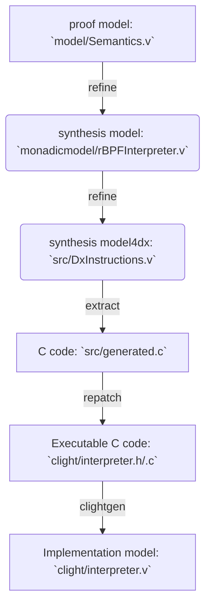

# rbpf-dx

A project for using dx to transform CertrBPF in Coq to C

## CertirBPF Overview

CertirBPF is a formally verified rBPF interpreter in Coq. (rBPF is a register-based virtual machine of eBPF) It consists of the following models:

- The proof model: formal syntax and semantics of rBPF in coq as well as the expected isolation property proof. (see the `model` and `isolation` folders)

- The synthesis model: an optimizated & formal rBPF interpreter model in Coq (see the `src` folder), it is equivalent to the proof model (see the `equivalence` folder) but its *code-style* is very close to the original rBPF C implementaion. This Coq model is extracted to C code by the [dx](https://gitlab.univ-lille.fr/samuel.hym/dx) tool.

- The clight model: the extracted C implementation could be re-extracted to a CompCert Clight model by [VST-clight](https://github.com/PrincetonUniversity/VST) (see `clight`). Then refinement proof between the synthesis model and the clight model can be done with the help of our ClightLogic framework (see `proof`).

There are also some folders:

1. `comm`: all comm definitions and functions shared by above three models, e.g. `State`, `Monad`, etc.
2. `repatch`: repatching the dx-extracted C implementation in order to make it executable.
3. `benchmark data`: all experiment data from our benchmark.

## Installation

### Dependencies

To install CertirBPF (and dx), you will require:
-   Linux (e.g. Ubuntu)
-   `make` (and standard tools: `sed`, `awk`, `cat`)
-   Coq
-   coq-elpi
-   CompCert32 (version 3.9)
-   VST32 (version 2.8)
-   OCaml compiler

CertirBPF is currently developed with the following versions of these
dependencies:

```shell
opam list ocaml coq coq-elpi coq-compcert-32 coq-vst-32
# Name          # Installed # Synopsis
coq             8.13.2      Formal proof management system
coq-compcert-32 3.9         The CompCert C compiler (32 bit)
coq-elpi        1.11.0      Elpi extension language for Coq
coq-vst-32      2.8         Verified Software Toolchain
ocaml           4.11.1      The OCaml compiler (virtual package)

```
### Building CertirBPF

_NB: you need to modify the makefile of the source project_, to run this repo:
1. install `dx`
```shell
$ git clone https://gitlab.univ-lille.fr/samuel.hym/dx
$ cd dx
$ ./configure ...
$ ./configure --install-compcert-printer --cprinterdir=/home/YOUR-NAME/.opam/YOUR-BPF-OPAM-SWITCH/lib/coq/user-contrib/dx/extr
$ make; make install
```
2. download this repo and config the Makefie.config:
```shell
$ git clone THIS-REPO
$ cd rbpf-dx
$ vim Makefile.config #`OPAMPREFIX := `/home/YOUR-NAME/.opam/YOUR-BPF-OPAM-SWITCH`
$ make all
```

*You also need to set path of Compcert32 in the environment.*

## Checking Coq code

`make all`
1. compiling the proof model, the synthesis model and the clight model;

2. extracting the verified C implementation; 

3. extracting Clight implemementation model;

4. checking the isolation proof of the proof model.

5. checking the equivalence relation (equality) among the proof model and two synthesis models.

6. checking the simulation relation proof (refinement) from Coq to Clight.


## Workflow

- **compile**:


- **proof**:


